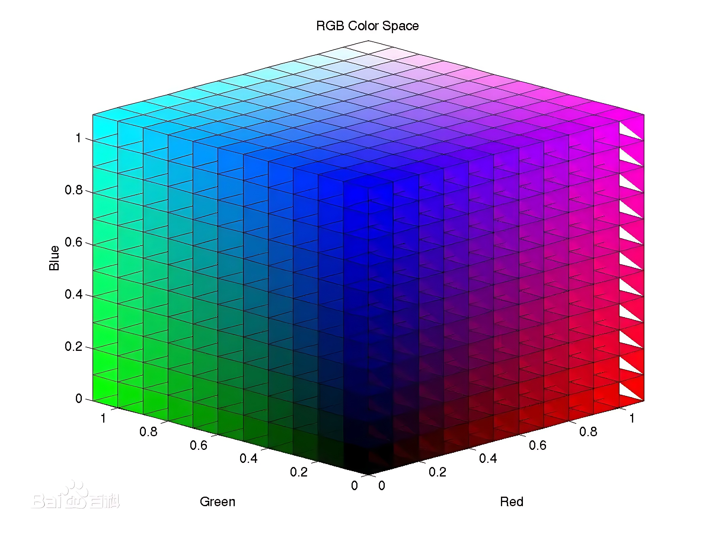
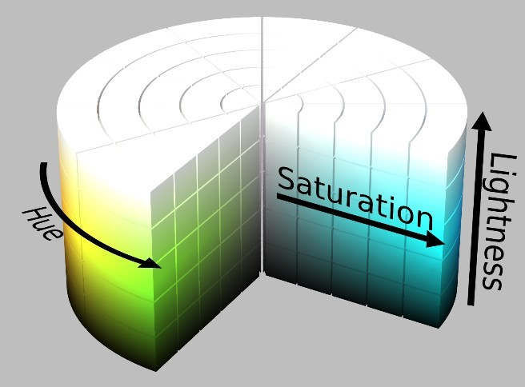
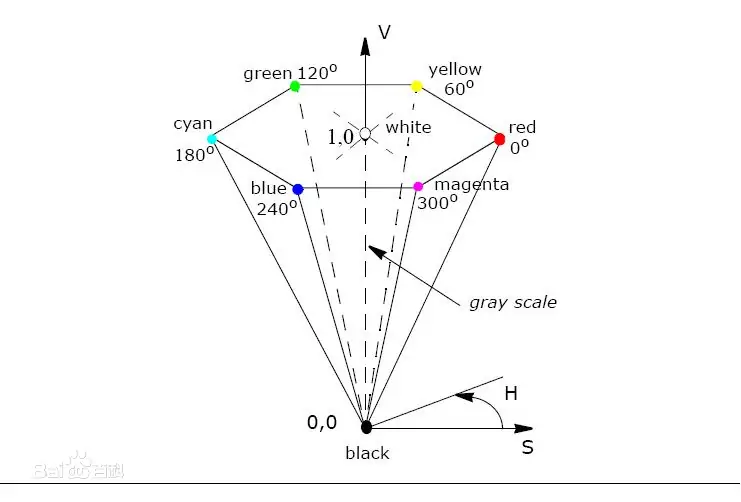
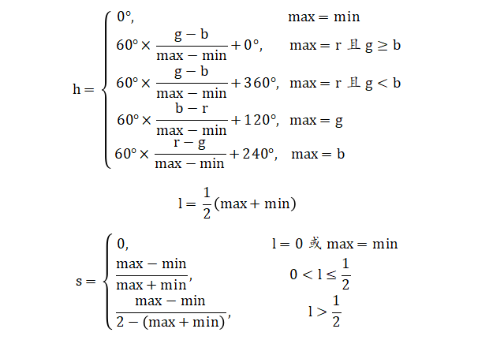
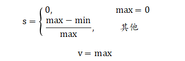
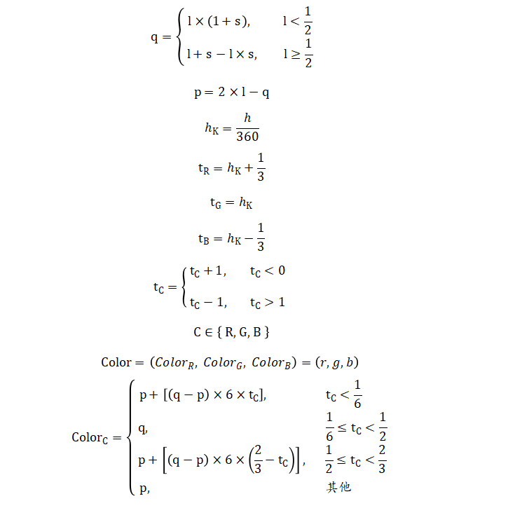
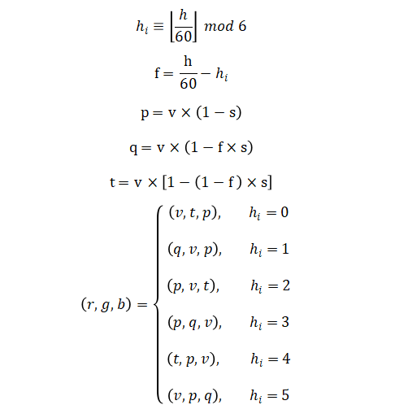

# 颜色拾取器

​		基于 `<map>`、`<input>` 以及 `HTML5` 拾色器元素，构建的颜色拾取器（在颜色上单击，就能拾取对应的颜色）。

​		特色 / 构造：

- 基于 `<map>` 的蜂窝拾色器
- 基于 `<input type="text">` 的颜色输入框
- 基于 `<input type="color">` 的 `HTML5` 拾色器
- 包含 `RGB`、`HSL`、`HSV` 颜色模型的颜色展示区
- 基于 `HSL` 颜色模型的亮度货柜


### 颜色系统

#### 颜色模型

​		颜色模型：`RGB`、`HSL`、`HSV`。其中，`HSV` 和 `HSL` 是对 `RGB` 色彩空间点的两种描述方法。

- `RGB`：`Red`（红色）、`Green`（绿色）、`Blue`（蓝色）；
- `HSL`：`Hue`（色相）、`Saturation`（饱和度）、`Value`（色调）；亦称 `HSB`（`Brightness`，明度）
- `HSV`：`Hue`（色相）、`Saturation`（饱和度）、`Lightness`（亮度）。







#### 模型转换

​		众所周知：

- （1）在 `RGB` 模型的色彩空间中，使用 `(r, g, b)` 表示是一个颜色的坐标，且 `r, g, b ∈ [0, 1]`。

- （2）在 `HSL` 空间中，使用 `(h, s, l)` 表示一个颜色，且 `h ∈ [0, 360]`，`s, l ∈ [0, 1]`。

- （3）在 `HSV` 空间中，使用 `(h, s, v)` 表示一个颜色，且 `h ∈ [0, 360]`，`s, v ∈ [0, 1]`。

##### `RGB` 转 `HSL`

​		若设 `max` 为 `r, g, b` 中的最大值，`min` 为三者中的最小值，则从 `RGB` 到 `HSL` 的计算公式为：



##### `RGB` 转 `HSV`

​		`HSL` 和 `HSV` 的 [色相](http://zh.wikipedia.org/wiki/色相) 相同，其他分量不同。`HSV` 中 `s` 和 `v` 的值定义如下：



##### `HSL` 转 `RGB`

​		从 `HSL` 到 `RGB` 的转换规则如下：

- 若 `s = 0`，`r = g = b = l`。注意，此时 `h` 的值是未定义的。


- 若 `s ≠ 0`，可以使用下列公式：




##### `HSV` 转 `RGB`

​		从 `HSV` 到 `RGB` 的转换公式如下：




### 基础实现

#### 结构

​	首先，构建 `HTML` 基础结构。

```html
<table class="reference">
    <tr id="main-line">
        <!-- 选取颜色 -->
        <td>
            <h3>选取颜色:</h3>
            <div class="main-line-wrap">
                <!-- 蜂窝拾色器 -->
                
                <map id="colormap" name="colormap" onmouseout="mouseOutMap()">
                    <area shape="poly" coords="" onclick="clickColor()" onmouseover="mouseOverColor()">
                </map>
                <!-- 六边形选区 -->
                <div id="selectedhexagon"></div>
                <!-- 颜色预览 -->
                <div id="divpreview"></div>
                <h3>或输入颜色值:</h3>
                <!-- 颜色值输入框 -->
                <div id="entercolorDIV">
                    <input type="text" id="entercolor" placeholder="颜色值"
                           onkeydown="submitOnEnter()"
                           onfocus="clearWrongInput()"
                           >
                    <button type="button" onclick="clickColor()">OK</button>
                </div>
                <!-- 输入错误提示框 -->
                <div id="wronginputDIV">Wrong Input</div>
                <!-- HTML5 拾色器 -->
                <div id="html5DIV">
                    <h3>或使用 HTML5:</h3>
                    <input type="color" id="html5colorpicker" onchange="clickColor()" value="#ff0000">
                </div>
            </div>
        </td>
        <!-- 查看颜色 -->
        <td>
            <h3>选择的颜色:</h3>
            <div id="selectedcolor">
                <p>黑色文本</p>
                <p>阴影</p>
                <p>白色文本</p>
                <p>阴影</p>
            </div>
            <div id="colornamDIV">red</div>
            <div id="colorhexDIV">#ff0000</div>
            <div id="colorrgbDIV">rgb(255, 0, 0)</div>
            <div id="colorhslDIV">hsl(0, 100%, 50%)</div>
            <div id="colorhsvDIV">hsv(0, 100%, 100%)</div>
        </td>
        <td>
            <!-- 亮度货柜 -->
            <div id="lumtopcontainer">
                <h3>淡 → 暗:</h3>
                <!-- 颜色表 -->
                <table id="colorTable">
                    <tr>
                        <td>100%</td>
                        <td style="background-color: #ffffff" onclick="clickColor()"></td>
                        <td>#ffffff</td>
                    </tr>
                </table>
            </div>
        </td>
    </tr>
</table>
```

##### 蜂窝拾色器

​		蜂窝拾色器，使用 `<map>` 构建图像映射。`<area>`（映射区域）的形状选择多边形（`shape="poly"`），坐标（`coords`）可手动计算，也可通过 `PS` 等工具获取。

```html

<map id="colormap" name="colormap">
	<area shape="poly" coords="63,0,72,4,72,15,63,19,54,15,54,4">
	<area shape="poly" coords="81,0,90,4,90,15,81,19,72,15,72,4">
    <area shape="poly" coords="99,0,108,4,108,15,99,19,90,15,90,4">
    <area shape="poly" coords="117,0,126,4,126,15,117,19,108,15,108,4">
    <area shape="poly" coords="135,0,144,4,144,15,135,19,126,15,126,4">
    <area shape="poly" coords="153,0,162,4,162,15,153,19,144,15,144,4">
    <area shape="poly" coords="171,0,180,4,180,15,171,19,162,15,162,4">
    <area shape="poly" coords="54,15,63,19,63,30,54,34,45,30,45,19">
    <area shape="poly" coords="72,15,81,19,81,30,72,34,63,30,63,19">
    <area shape="poly" coords="90,15,99,19,99,30,90,34,81,30,81,19">
    <area shape="poly" coords="108,15,117,19,117,30,108,34,99,30,99,19">
    <area shape="poly" coords="126,15,135,19,135,30,126,34,117,30,117,19">
    <area shape="poly" coords="144,15,153,19,153,30,144,34,135,30,135,19">
    <area shape="poly" coords="162,15,171,19,171,30,162,34,153,30,153,19">
    <area shape="poly" coords="180,15,189,19,189,30,180,34,171,30,171,19">
    <area shape="poly" coords="45,30,54,34,54,45,45,49,36,45,36,34">
    <area shape="poly" coords="63,30,72,34,72,45,63,49,54,45,54,34">
    <area shape="poly" coords="81,30,90,34,90,45,81,49,72,45,72,34">
    <area shape="poly" coords="99,30,108,34,108,45,99,49,90,45,90,34">
    <area shape="poly" coords="117,30,126,34,126,45,117,49,108,45,108,34">
    <area shape="poly" coords="135,30,144,34,144,45,135,49,126,45,126,34">
    <area shape="poly" coords="153,30,162,34,162,45,153,49,144,45,144,34">
    <area shape="poly" coords="171,30,180,34,180,45,171,49,162,45,162,34">
    <area shape="poly" coords="189,30,198,34,198,45,189,49,180,45,180,34">
    <area shape="poly" coords="36,45,45,49,45,60,36,64,27,60,27,49">
    <area shape="poly" coords="54,45,63,49,63,60,54,64,45,60,45,49">
    <area shape="poly" coords="72,45,81,49,81,60,72,64,63,60,63,49">
    <area shape="poly" coords="90,45,99,49,99,60,90,64,81,60,81,49">
    <area shape="poly" coords="108,45,117,49,117,60,108,64,99,60,99,49">
    <area shape="poly" coords="126,45,135,49,135,60,126,64,117,60,117,49">
    <area shape="poly" coords="144,45,153,49,153,60,144,64,135,60,135,49">
    <area shape="poly" coords="162,45,171,49,171,60,162,64,153,60,153,49">
    <area shape="poly" coords="180,45,189,49,189,60,180,64,171,60,171,49">
    <area shape="poly" coords="198,45,207,49,207,60,198,64,189,60,189,49">
    <area shape="poly" coords="27,60,36,64,36,75,27,79,18,75,18,64">
    <area shape="poly" coords="45,60,54,64,54,75,45,79,36,75,36,64">
    <area shape="poly" coords="63,60,72,64,72,75,63,79,54,75,54,64">
    <area shape="poly" coords="81,60,90,64,90,75,81,79,72,75,72,64">
    <area shape="poly" coords="99,60,108,64,108,75,99,79,90,75,90,64">
    <area shape="poly" coords="117,60,126,64,126,75,117,79,108,75,108,64">
    <area shape="poly" coords="135,60,144,64,144,75,135,79,126,75,126,64">
    <area shape="poly" coords="153,60,162,64,162,75,153,79,144,75,144,64">
    <area shape="poly" coords="171,60,180,64,180,75,171,79,162,75,162,64">
    <area shape="poly" coords="189,60,198,64,198,75,189,79,180,75,180,64">
    <area shape="poly" coords="207,60,216,64,216,75,207,79,198,75,198,64">
    <area shape="poly" coords="18,75,27,79,27,90,18,94,9,90,9,79"> 
    <area shape="poly" coords="36,75,45,79,45,90,36,94,27,90,27,79">
    <area shape="poly" coords="54,75,63,79,63,90,54,94,45,90,45,79">
    <area shape="poly" coords="72,75,81,79,81,90,72,94,63,90,63,79">
    <area shape="poly" coords="90,75,99,79,99,90,90,94,81,90,81,79">
    <area shape="poly" coords="108,75,117,79,117,90,108,94,99,90,99,79">
    <area shape="poly" coords="126,75,135,79,135,90,126,94,117,90,117,79">
    <area shape="poly" coords="144,75,153,79,153,90,144,94,135,90,135,79">
    <area shape="poly" coords="162,75,171,79,171,90,162,94,153,90,153,79">
    <area shape="poly" coords="180,75,189,79,189,90,180,94,171,90,171,79">
    <area shape="poly" coords="198,75,207,79,207,90,198,94,189,90,189,79">
    <area shape="poly" coords="216,75,225,79,225,90,216,94,207,90,207,79">
    <area shape="poly" coords="9,90,18,94,18,105,9,109,0,105,0,94"> 
    <area shape="poly" coords="27,90,36,94,36,105,27,109,18,105,18,94">
    <area shape="poly" coords="45,90,54,94,54,105,45,109,36,105,36,94">
    <area shape="poly" coords="63,90,72,94,72,105,63,109,54,105,54,94">
    <area shape="poly" coords="81,90,90,94,90,105,81,109,72,105,72,94">
    <area shape="poly" coords="99,90,108,94,108,105,99,109,90,105,90,94">
    <area shape="poly" coords="117,90,126,94,126,105,117,109,108,105,108,94">
    <area shape="poly" coords="135,90,144,94,144,105,135,109,126,105,126,94">
    <area shape="poly" coords="153,90,162,94,162,105,153,109,144,105,144,94">
    <area shape="poly" coords="171,90,180,94,180,105,171,109,162,105,162,94">
    <area shape="poly" coords="189,90,198,94,198,105,189,109,180,105,180,94">
    <area shape="poly" coords="207,90,216,94,216,105,207,109,198,105,198,94">
    <area shape="poly" coords="225,90,234,94,234,105,225,109,216,105,216,94">
    <area shape="poly" coords="18,105,27,109,27,120,18,124,9,120,9,109">
    <area shape="poly" coords="36,105,45,109,45,120,36,124,27,120,27,109">
    <area shape="poly" coords="54,105,63,109,63,120,54,124,45,120,45,109">
    <area shape="poly" coords="72,105,81,109,81,120,72,124,63,120,63,109">
    <area shape="poly" coords="90,105,99,109,99,120,90,124,81,120,81,109">
    <area shape="poly" coords="108,105,117,109,117,120,108,124,99,120,99,109">
    <area shape="poly" coords="126,105,135,109,135,120,126,124,117,120,117,109">
    <area shape="poly" coords="144,105,153,109,153,120,144,124,135,120,135,109">
    <area shape="poly" coords="162,105,171,109,171,120,162,124,153,120,153,109">
    <area shape="poly" coords="180,105,189,109,189,120,180,124,171,120,171,109">
    <area shape="poly" coords="198,105,207,109,207,120,198,124,189,120,189,109">
    <area shape="poly" coords="216,105,225,109,225,120,216,124,207,120,207,109">
    <area shape="poly" coords="27,120,36,124,36,135,27,139,18,135,18,124">
    <area shape="poly" coords="45,120,54,124,54,135,45,139,36,135,36,124">
    <area shape="poly" coords="63,120,72,124,72,135,63,139,54,135,54,124">
    <area shape="poly" coords="81,120,90,124,90,135,81,139,72,135,72,124">
    <area shape="poly" coords="99,120,108,124,108,135,99,139,90,135,90,124">
    <area shape="poly" coords="117,120,126,124,126,135,117,139,108,135,108,124">
    <area shape="poly" coords="135,120,144,124,144,135,135,139,126,135,126,124">
    <area shape="poly" coords="153,120,162,124,162,135,153,139,144,135,144,124">
    <area shape="poly" coords="171,120,180,124,180,135,171,139,162,135,162,124">
    <area shape="poly" coords="189,120,198,124,198,135,189,139,180,135,180,124">
    <area shape="poly" coords="207,120,216,124,216,135,207,139,198,135,198,124">
    <area shape="poly" coords="36,135,45,139,45,150,36,154,27,150,27,139">
    <area shape="poly" coords="54,135,63,139,63,150,54,154,45,150,45,139">
    <area shape="poly" coords="72,135,81,139,81,150,72,154,63,150,63,139">
    <area shape="poly" coords="90,135,99,139,99,150,90,154,81,150,81,139">
    <area shape="poly" coords="108,135,117,139,117,150,108,154,99,150,99,139">
    <area shape="poly" coords="126,135,135,139,135,150,126,154,117,150,117,139">
    <area shape="poly" coords="144,135,153,139,153,150,144,154,135,150,135,139">
    <area shape="poly" coords="162,135,171,139,171,150,162,154,153,150,153,139">
    <area shape="poly" coords="180,135,189,139,189,150,180,154,171,150,171,139">
    <area shape="poly" coords="198,135,207,139,207,150,198,154,189,150,189,139">
    <area shape="poly" coords="45,150,54,154,54,165,45,169,36,165,36,154">
    <area shape="poly" coords="63,150,72,154,72,165,63,169,54,165,54,154">
    <area shape="poly" coords="81,150,90,154,90,165,81,169,72,165,72,154">
    <area shape="poly" coords="99,150,108,154,108,165,99,169,90,165,90,154">
    <area shape="poly" coords="117,150,126,154,126,165,117,169,108,165,108,154">
    <area shape="poly" coords="135,150,144,154,144,165,135,169,126,165,126,154">
    <area shape="poly" coords="153,150,162,154,162,165,153,169,144,165,144,154">
    <area shape="poly" coords="171,150,180,154,180,165,171,169,162,165,162,154">
    <area shape="poly" coords="189,150,198,154,198,165,189,169,180,165,180,154">
    <area shape="poly" coords="54,165,63,169,63,180,54,184,45,180,45,169">
    <area shape="poly" coords="72,165,81,169,81,180,72,184,63,180,63,169">
    <area shape="poly" coords="90,165,99,169,99,180,90,184,81,180,81,169">
    <area shape="poly" coords="108,165,117,169,117,180,108,184,99,180,99,169">
    <area shape="poly" coords="126,165,135,169,135,180,126,184,117,180,117,169">
    <area shape="poly" coords="144,165,153,169,153,180,144,184,135,180,135,169">
    <area shape="poly" coords="162,165,171,169,171,180,162,184,153,180,153,169">
    <area shape="poly" coords="180,165,189,169,189,180,180,184,171,180,171,169">
    <area shape="poly" coords="63,180,72,184,72,195,63,199,54,195,54,184">
    <area shape="poly" coords="81,180,90,184,90,195,81,199,72,195,72,184">
    <area shape="poly" coords="99,180,108,184,108,195,99,199,90,195,90,184">
    <area shape="poly" coords="117,180,126,184,126,195,117,199,108,195,108,184">
    <area shape="poly" coords="135,180,144,184,144,195,135,199,126,195,126,184">
    <area shape="poly" coords="153,180,162,184,162,195,153,199,144,195,144,184">
    <area shape="poly" coords="171,180,180,184,180,195,171,199,162,195,162,184">
</map>
```

##### 亮度货柜

​		亮度货柜，根据 `HSL` 颜色模型中 `L` 的值，从 0% 到 100% 按 5% 的梯度依次进行分层，共 21 层。每一层，由三个单元格组成：第一个单元格展示当前的亮度，第二个单元格展示当前的颜色，第三个单元格展示当前颜色的十六进制值。

```html
<table id="colorTable">
    <tr><td>100%</td><td></td><td>#ffffff</td></tr>
    <tr><td>95%</td><td></td><td></td></tr>
    <tr><td>90%</td><td></td><td></td></tr>
    <tr><td>85%</td><td></td><td></td></tr>
    <tr><td>80%</td><td></td><td></td></tr>
    <tr><td>75%</td><td></td><td></td></tr>
    <tr><td>70%</td><td></td><td></td></tr>
    <tr><td>65%</td><td></td><td></td></tr>
    <tr><td>60%</td><td></td><td></td></tr>
    <tr><td>55%</td><td></td><td></td></tr>
    <tr><td>50%</td><td></td><td></td></tr>
    <tr><td>45%</td><td></td><td></td></tr>
    <tr><td>40%</td><td></td><td></td></tr>
    <tr><td>35%</td><td></td><td></td></tr>
    <tr><td>30%</td><td></td><td></td></tr>
    <tr><td>25%</td><td></td><td></td></tr>
    <tr><td>20%</td><td></td><td></td></tr>
    <tr><td>15%</td><td></td><td></td></tr>
    <tr><td>10%</td><td></td><td></td></tr>
    <tr><td>5%</td><td></td><td></td></tr>
    <tr><td>0%</td><td></td><td>#000000</td></tr>
</table>
```

#### 样式

​		添加基础的样式：

```css
body, div, h3, html, img, span, table, tbody, td, tr {
    border: 0;
    margin: 0;
    padding: 0
}

body {
    color: #333;
    background-color: #f6f6f6;
}

h3 {
    font-size: 1.4em;
    font-weight: 700;
    margin: 8px 0;
}

button, input {
    outline: 0;
}

button, input, td {
    font-size: 14px;
}

img {
    margin-right: 2px;
    margin-bottom: -8px;
}

area {
    cursor: pointer;
}

table.reference {
    border-collapse: collapse;
    width: 60%;
    margin: 4px auto;
    text-align: center;
}

table.reference td {
    min-width: 24px;
    padding: 5px;
    padding-top: 7px;
    padding-bottom: 7px;
    line-height: 2em;
    border: 1px solid #d4d4d4;
    vertical-align: top
}

#main-line>td {
    width: calc(100% / 3);
}

#main-line .main-line-wrap {
    width: 236px;
    margin: auto;
}

#selectedhexagon {
    position: relative;
    top: -35px;
    left: 135px;
    width: 21px;
    height: 21px;
    background-image: url(./imgs/img_selectedcolor.gif);
    visibility: visible;
}

#divpreview {
    width: 80px;
    height: 20px;
    margin: auto;
    border: 1px solid #e3e3e3;
    background-color: rgb(255, 0, 0);
    visibility: hidden;
}

#wronginputDIV {
    display: none;
    position: absolute;
    margin: 4px 10px;
    text-align: left;
    color: #a94442;
}

#html5DIV {
    margin-top: 32px;
}

#selectedcolor {
    display: flex;
    flex-direction: column;
    justify-content: center;
    align-items: center;
    width: 80%;
    height: 300px;
    margin: auto;
    font-size: 18px !important;
    border: 1px solid #e3e3e3;
    background-color: rgb(255, 0, 0);
}

#colorTable {
    width: 100%;
}
```

#### 逻辑

##### 工具封装

​		首先，在立即执行函数中封装一个 `tinycolor` 工具，用以满足复杂计算和转换的需要。例如，从 `RGB` 颜色模型转为 `HSL`、`HSV` 颜色模型，将十进制数值转为十六进制等。

​		1、定义 `tinycolor()` 构造函数，用于构造微小的颜色对象。 

```js
(function () {
    const trimLeft = /^\s+/,
          trimRight = /\s+$/,
          mathRound = Math.round,
          mathMin = Math.min,
          mathMax = Math.max;

    // tinycolor构造函数，构造微小的颜色对象
    function tinycolor(color, opts) {
        // 设置color和opts的默认值
        color = color || "";
        opts = opts || {};
        // 如果color已经是tinycolor的实例, 则直接返回color即可
        if (color instanceof tinycolor) { return color }
        // 将new操作符调到函数内部来执行（如果this不是tinycolor的实例，则返回tinycolor的实例）
        if (!(this instanceof tinycolor)) { 
            return new tinycolor(color, opts);
        }
        // 颜色值转为rgb格式的对象
        const rgb = inputToRGB(color);
        this._r = rgb.r;
        this._g = rgb.g;
        this._b = rgb.b;
        this._a = rgb.a;
        this._roundA = mathRound(100 * this._a) / 100;
        this._format = opts.format || rgb.format;
        // 将小于1的三原色值四舍五入
        if (this._r < 1) { this._r = mathRound(this._r) }
        if (this._g < 1) { this._g = mathRound(this._g) }
        if (this._b < 1) { this._b = mathRound(this._b) }
        // rbg的状态
        this._ok = rgb.ok;
    }
    
    // 是否是浮点值1.0
    function isOnePointZero(n) {
        return parseFloat(n) - 1 < 0.000001 && parseInt(n) === 1;
    }
    
    // 是否是百分比数值
    function isPercentage(n) {
        return typeof n === "string" && n.indexOf("%") !== -1;
    }
    
    // 约束n/max的值，限制为[0, 1]
    function bound01(n, max) {
        // 如果是浮点值1.0，则转为100%
        if (isOnePointZero(n)) n = "100%";
        // 是否是百分比数值
        const processPercent = isPercentage(n);
        // 限制数值范围：[0, max]
        n = mathMin(mathMax(0, parseFloat(n)), max);
        // 如果是百分比数值，转为浮点值
        if (processPercent) n = parseInt(n * max) / 100;
        // 如果n接近于max（差值小于百万分之一），则视为相等
        if ((Math.abs(n - max) < 0.000001)) return 1;
        // 返回n与max的比值
        return (n % max) / parseFloat(max);
    }
    
    // 将rgb值转为rgb对象
    function rgbToRgb(r, g, b) {
        return {
            r: bound01(r, 255) * 255,
            g: bound01(g, 255) * 255,
            b: bound01(b, 255) * 255
        }
    }
    
    // 转为百分比值
    function convertToPercentage(n) {
        if (n <= 1) {
            n = `${n * 100}%`;
        }
        return n;
    }
    
    // hsv转为rgb对象
    function hsvToRgb(h, s, v) {
        h = bound01(h, 360) * 6;
        s = bound01(s, 100);
        v = bound01(v, 100);
        const i = Math.floor(h),
              f = h - i,
              p = v * (1 - s),
              q = v * (1 - f * s),
              t = v * (1 - (1 - f) * s),
              mod = i % 6,
              r = [v, q, p, p, t, v][mod],
              g = [t, v, v, q, p, p][mod],
              b = [p, p, t, v, v, q][mod];
        return {
            r: r * 255,
            g: g * 255,
            b: b * 255
        };
    }
    
   	// hsl转为rgb对象
    function hslToRgb(h, s, l) {
        h = bound01(h, 360);
        s = bound01(s, 100);
        l = bound01(l, 100);
        let r, g, b;
        function hue2rgb(p, q, t) {
            if (t < 0) t += 1;
            if (t > 1) t -= 1;
            if (t < 1 / 6) return p + (q - p) * 6 * t;
            if (t < 1 / 2) return q;
            if (t < 2 / 3) return p + (q - p) * (2 / 3 - t) * 6;
            return p;
        }
        if (s === 0) {
            r = g = b = l;
        } else {
            const q = l < 0.5 ? l * (1 + s) : l + s - l * s,
                  p = 2 * l - q;
            r = hue2rgb(p, q, h + 1 / 3);
            g = hue2rgb(p, q, h);
            b = hue2rgb(p, q, h - 1 / 3);
        }
        return {
            r: r * 255,
            g: g * 255,
            b: b * 255
        };
    }
    
    // 约束透明度，范围[0, 1]
    function boundAlpha(a) {
        a = parseFloat(a);
        if (isNaN(a) || a < 0 || a > 1) a = 1;
        return a;
    }
    
    // 转为rgb对象
    function inputToRGB(color) {
        // rgb对象初始状态
        let rgb = { r: 0, g: 0, b: 0 },
            alpha = 1, // 透明度
            ok = false, // 转换状态
            format = ""; // 格式标识
        // 如果是字符串，则转为对应的color对象
        if (typeof color === "string") { 
            color = stringInputToObject(color); 
        }
        // 如果是对象，转为格式化的rgb对象
        if (typeof color === "object") {
            if (color.hasOwnProperty("r") && color.hasOwnProperty("g") && color.hasOwnProperty("b")) {
                // 如果是rgb对象，则将其转为格式化的rgb对象
                rgb = rgbToRgb(color.r, color.g, color.b);
                ok = true;
                // 格式标识
                format = String(color.r).substr(-1) === "%" ? "prgb" : "rgb";
            } else {
                // 如果是hsv对象，则将其转为格式化的rgb对象
                if (color.hasOwnProperty("h") && color.hasOwnProperty("s") && color.hasOwnProperty("v")) {
                    // 转为百分比值
                    color.s = convertToPercentage(color.s);
                    color.v = convertToPercentage(color.v);
                    // hsv对象转为rgb对象
                    rgb = hsvToRgb(color.h, color.s, color.v);
                    ok = true; 
                    format = "hsv";
                } else {
                    // 如果是hsl对象，则将其转为格式化的rgb对象
                    if (color.hasOwnProperty("h") && color.hasOwnProperty("s") && color.hasOwnProperty("l")) {
                        color.s = convertToPercentage(color.s);
                        color.l = convertToPercentage(color.l);
                        // hsl对象转为rgb对象
                        rgb = hslToRgb(color.h, color.s, color.l);
                        ok = true; 
                        format = "hsl";
                    }
                }
            }
            // 如果有透明度，获取透明度
            if (color.hasOwnProperty("a")) {
                alpha = color.a;
            }
        }
        // 约束透明度
        alpha = boundAlpha(alpha);
        return {
            r: mathMin(255, mathMax(rgb.r, 0)),
            g: mathMin(255, mathMax(rgb.g, 0)),
            b: mathMin(255, mathMax(rgb.b, 0)),
            ok: ok,
            format: color.format || format,
            a: alpha
        }
    }
    
    // 颜色名称对象
    const names = tinycolor.names = {
        aliceblue: "f0f8ff", antiquewhite: "faebd7", aqua: "0ff",
        aquamarine: "7fffd4", azure: "f0ffff", beige: "f5f5dc",
        bisque: "ffe4c4", black: "000", blanchedalmond: "ffebcd",
        blue: "00f", blueviolet: "8a2be2", brown: "a52a2a",
        burlywood: "deb887", burntsienna: "ea7e5d", cadetblue: "5f9ea0",
        chartreuse: "7fff00", chocolate: "d2691e", coral: "ff7f50",
        cornflowerblue: "6495ed", cornsilk: "fff8dc", crimson: "dc143c",
        cyan: "0ff", darkblue: "00008b", darkcyan: "008b8b",
        darkgoldenrod: "b8860b", darkgray: "a9a9a9", darkgreen: "006400",
        darkgrey: "a9a9a9", darkkhaki: "bdb76b", darkmagenta: "8b008b",
        darkolivegreen: "556b2f", darkorange: "ff8c00", darkorchid: "9932cc",
        darkred: "8b0000", darksalmon: "e9967a", darkseagreen: "8fbc8f",
        darkslateblue: "483d8b", darkslategray: "2f4f4f", darkslategrey: "2f4f4f",
        darkturquoise: "00ced1", darkviolet: "9400d3", deeppink: "ff1493",
        deepskyblue: "00bfff", dimgray: "696969", dimgrey: "696969",
        dodgerblue: "1e90ff", firebrick: "b22222", floralwhite: "fffaf0",
        forestgreen: "228b22", fuchsia: "f0f", gainsboro: "dcdcdc",
        ghostwhite: "f8f8ff", gold: "ffd700", goldenrod: "daa520",
        gray: "808080", green: "008000", greenyellow: "adff2f",
        grey: "808080", honeydew: "f0fff0", hotpink: "ff69b4",
        indianred: "cd5c5c", indigo: "4b0082", ivory: "fffff0",
        khaki: "f0e68c", lavender: "e6e6fa", lavenderblush: "fff0f5",
        lawngreen: "7cfc00", lemonchiffon: "fffacd", lightblue: "add8e6",
        lightcoral: "f08080", lightcyan: "e0ffff", lightgoldenrodyellow: "fafad2",
        lightgray: "d3d3d3", lightgreen: "90ee90", lightgrey: "d3d3d3",
        lightpink: "ffb6c1", lightsalmon: "ffa07a", lightseagreen: "20b2aa",
        lightskyblue: "87cefa", lightslategray: "789", lightslategrey: "789",
        lightsteelblue: "b0c4de", lightyellow: "ffffe0", lime: "0f0",
        limegreen: "32cd32", linen: "faf0e6", magenta: "f0f",
        maroon: "800000", mediumaquamarine: "66cdaa", mediumblue: "0000cd",
        mediumorchid: "ba55d3", mediumpurple: "9370db", mediumseagreen: "3cb371",
        mediumslateblue: "7b68ee", mediumspringgreen: "00fa9a", mediumturquoise: "48d1cc",
        mediumvioletred: "c71585", midnightblue: "191970", mintcream: "f5fffa",
        mistyrose: "ffe4e1", moccasin: "ffe4b5", navajowhite: "ffdead",
        navy: "000080", oldlace: "fdf5e6", olive: "808000",
        olivedrab: "6b8e23", orange: "ffa500", orangered: "ff4500",
        orchid: "da70d6", palegoldenrod: "eee8aa", palegreen: "98fb98",
        paleturquoise: "afeeee", palevioletred: "db7093", papayawhip: "ffefd5",
        peachpuff: "ffdab9", peru: "cd853f", pink: "ffc0cb",
        plum: "dda0dd", powderblue: "b0e0e6", purple: "800080",
        rebeccapurple: "663399", red: "f00", rosybrown: "bc8f8f",
        royalblue: "4169e1", saddlebrown: "8b4513", salmon: "fa8072",
        sandybrown: "f4a460", seagreen: "2e8b57", seashell: "fff5ee",
        sienna: "a0522d", silver: "c0c0c0", skyblue: "87ceeb",
        slateblue: "6a5acd", slategray: "708090", slategrey: "708090",
        snow: "fffafa", springgreen: "00ff7f", steelblue: "4682b4",
        tan: "d2b48c", teal: "008080", thistle: "d8bfd8",
        tomato: "ff6347", turquoise: "40e0d0", violet: "ee82ee",
        wheat: "f5deb3", white: "fff", whitesmoke: "f5f5f5",
        yellow: "ff0", yellowgreen: "9acd32"
    };
    
    // 创建正则对象
    const matchers = (function () {
        const CSS_INTEGER = "[-\\+]?\\d+%?",
              CSS_NUMBER = "[-\\+]?\\d*\\.\\d+%?",
              CSS_UNIT = `(?:${CSS_NUMBER})|(?:${CSS_INTEGER})`,
              PERMISSIVE_MATCH3 = `[\\s|\\(]+(${CSS_UNIT})[,|\\s]+(${CSS_UNIT})[,|\\s]+(${CSS_UNIT})\\s*\\)?`,
              PERMISSIVE_MATCH4 = `[\\s|\\(]+(${CSS_UNIT})[,|\\s]+(${CSS_UNIT})[,|\\s]+(${CSS_UNIT})[,|\\s]+(${CSS_UNIT})\\s*\\)?`;
        return {
            rgb: new RegExp("rgb" + PERMISSIVE_MATCH3),
            rgba: new RegExp("rgba" + PERMISSIVE_MATCH4),
            hsl: new RegExp("hsl" + PERMISSIVE_MATCH3),
            hsla: new RegExp("hsla" + PERMISSIVE_MATCH4),
            hsv: new RegExp("hsv" + PERMISSIVE_MATCH3),
            hsva: new RegExp("hsva" + PERMISSIVE_MATCH4),
            hex3: /^#?([0-9a-fA-F]{1})([0-9a-fA-F]{1})([0-9a-fA-F]{1})$/,
            hex6: /^#?([0-9a-fA-F]{2})([0-9a-fA-F]{2})([0-9a-fA-F]{2})$/,
            hex8: /^#?([0-9a-fA-F]{2})([0-9a-fA-F]{2})([0-9a-fA-F]{2})([0-9a-fA-F]{2})$/
        }
    })();
    
    // 从十六进制值中取整为十进制值
    function parseIntFromHex(value) {
        return parseInt(value, 16);
    }
    
    // 将十六进制转为十进制
    function convertHexToDecimal(h) {
        return parseIntFromHex(h) / 255;
    }
    
    // 将字符串输入转为对象
    function stringInputToObject(color) {
        // 清除左右空格，转为全小写
        color = color.replace(trimLeft, "").replace(trimRight, "").toLowerCase();
        // 是否是颜色名称
        let named = false;
        // 如果颜色名称对象中有对应的颜色，则取其颜色值
        if (names[color]) {
            color = names[color];
            named = true;
        } else {
            // 如果颜色为透明，则直接返回透明颜色的rgb对象
            if (color === "transparent") {
                return {
                    r: 0,
                    g: 0,
                    b: 0,
                    a: 0,
                    format: "name"
                };
            }
        }
        // 正则匹配的结果
        let match;
        // 匹配颜色的格式，返回相应格式的color对象
        if (match = matchers.rgb.exec(color)) {
            return {r: match[1], g: match[2], b: match[3]};
        }
        if (match = matchers.rgba.exec(color)) { 
            return {r: match[1], g: match[2], b: match[3], a: match[4]};
        }
        if (match = matchers.hsl.exec(color)) {
            return {h: match[1], s: match[2], l: match[3]};
        }
        if (match = matchers.hsla.exec(color)) { 
            return {h: match[1], s: match[2], l: match[3], a: match[4]} 
        }
        if (match = matchers.hsv.exec(color)) {
            return {h: match[1], s: match[2], v: match[3]};
        }
        if (match = matchers.hsva.exec(color)) {
            return {h: match[1], s: match[2], v: match[3], a: match[4]}; 
        }
        if (match = matchers.hex8.exec(color)) {
            return {
                a: convertHexToDecimal(match[1]),
                r: parseIntFromHex(match[2]),
                g: parseIntFromHex(match[3]),
                b: parseIntFromHex(match[4]),
                format: named ? "name" : "hex8"
            }
        }
        if (match = matchers.hex6.exec(color)) {
            return {
                r: parseIntFromHex(match[1]),
                g: parseIntFromHex(match[2]),
                b: parseIntFromHex(match[3]),
                format: named ? "name" : "hex"
            }
        }
        if (match = matchers.hex3.exec(color)) {
            return {
                r: parseIntFromHex(match[1] + "" + match[1]),
                g: parseIntFromHex(match[2] + "" + match[2]),
                b: parseIntFromHex(match[3] + "" + match[3]),
                format: named ? "name" : "hex"
            }
        }
        // 转换失败，返回false
        return false;
	}
    
    // 接下文...
})();
```

​		2、定义 `tinycolor` 原型。

```js
// 接上文...

tinycolor.prototype = {
    // 根据rgb对象的状态, 检验合格性
    isValid() {
        return this._ok;
    },
    // 转为hsv格式的字符串
    toHsvString() {
        // rgb转为hsv对象
        const hsv = rgbToHsv(this._r, this._g, this._b),
              h = mathRound(hsv.h * 360),
              s = mathRound(hsv.s * 100),
              v = mathRound(hsv.v * 100);
        // 透明度如果为1，则忽略
        return this._a === 1 ? `hsv(${h}, ${s}%, ${v}%)` : `hsva(${h}, ${s}%, ${v}%, ${this._roundA})`;
    },
    // 转为hsl对象
    toHsl() {
        const hsl = rgbToHsl(this._r, this._g, this._b);
        return {
            h: hsl.h * 360,
            s: hsl.s,
            l: hsl.l,
            a: this._a
        };
    },
    // 转为hsl字符串
    toHslString() {
        const hsl = rgbToHsl(this._r, this._g, this._b),
              h = mathRound(hsl.h * 360), 
              s = mathRound(hsl.s * 100), 
              l = mathRound(hsl.l * 100);
        return this._a === 1 ? `hsl(${h}, ${s}%, ${l}%)` : `hsva(${h}, ${s}%, ${l}%, ${this._roundA})`;
    },
    // 转为hex字符串
    toHex(allow3Char) {
        return rgbToHex(this._r, this._g, this._b, allow3Char);
    },
    // 转为hex颜色值
    toHexString(allow3Char) {
        return `#${this.toHex(allow3Char)}`;
    },
    // 转为rgba对象
    toRgb() {
        return {
            r: mathRound(this._r),
            g: mathRound(this._g),
            b: mathRound(this._b),
            a: this._a
        }
    },
    // 转为rgb字符串
    toRgbString() {
        const r = mathRound(this._r),
              g = mathRound(this._g),
              b = mathRound(this._b);
        return this._a === 1 ? `rgb(${r}, ${g}, ${b})` : `rgba(${r}, ${g}, ${b}, ${this._roundA})`;
    },
    // // 转为颜色的名称
    toName() {
        // 透明度为0，表示透明
        if (this._a === 0) {
            return "transparent";
        }
        // 颜色名称的透明度均为1
        if (this._a < 1) {
            return false;
        }
        // 如果有十六机制的名称，则返回它；没有，则返回false
        return hexNames[rgbToHex(this._r, this._g, this._b, true)] || false;
    }
};

// rgb转为hsv对象
function rgbToHsv(r, g, b) {
    r = bound01(r, 255);
    g = bound01(g, 255);
    b = bound01(b, 255);
    const min = mathMin(r, g, b),
          max = mathMax(r, g, b),
          d = max - min,
          s = max === 0 ? 0 : d / max,
          v = max;
    let h = 0;
    if (max > min) {
        switch (max) {
            case r: h = (g - b) / d + (g < b ? 6 : 0); break;
            case g: h = (b - r) / d + 2; break;
            case b: h = (r - g) / d + 4; break;
        }
        h /= 6;
    }
    return {h, s, v};
}

// 将rgb值转为hsl对象
function rgbToHsl(r, g, b) {
    // 将三原色换为比例值
    r = bound01(r, 255);
    g = bound01(g, 255);
    b = bound01(b, 255);
    // 取三原色中的最大值和最小值
    const min = mathMin(r, g, b),
          max = mathMax(r, g, b),
          sum = max + min,
          l = sum / 2;
    let h = 0, 
        s = 0;
    if (max > min) {
        const d = max - min;
        s = l > 0.5 ? d / (2 - sum) : d / sum;
        switch (max) {
            case r:
                h = (g -b) / d + (g < b ? 6 : 0); break;
            case g:
                h = (b - r) / d + 2; break;
            case b:
                h = (r - g) / d + 4; break;
        }
        h /= 6;
    }
    return {h, s, l};
}

// 补齐长度为两位的字符串
function pad2(str) {
    return str.padStart(2, "0");
}

// rgb转为hex字符串
function rgbToHex(r, g, b, allow3Char) {
    // 四舍五入，转为十六进制字符串，长度补齐为2
    const hex = [
        pad2(mathRound(r).toString(16)),
        pad2(mathRound(g).toString(16)),
        pad2(mathRound(b).toString(16))
    ],
          hex00 = hex[0][0], hex01 = hex[0][1],
          hex10 = hex[1][0], hex11 = hex[1][1],
          hex20 = hex[2][0], hex21 = hex[2][1];
    // 如果允许三位颜色值且颜色是两位重复的六位颜色值（如aabbcc），则转为三位颜色值（如abc）
    if (allow3Char && hex00 === hex01 && hex10 === hex11 && hex20 === hex21) {
        return hex00 + hex10 + hex20;
    }
    // 其余情况，直接拼接即可
    return hex.join("");
}

// 十六进制格式的颜色名称对象
const hexNames = tinycolor.hexNames = flip(names);

// 将对象的属性和值对调，转存到新对象中
function flip(obj) {
    const flipped = {},
          keys = Object.keys(obj);
    for (const key of keys) {
        flipped[obj[key]] = key;
    }
    return flipped;
}

// 接下文...
```

​		3、导出 `tinycolor` 工具

```js
// 接上文...

// 导出tinycolor方法
if (typeof module !== "undefined" && module.exports) {
    // 模块导出
    module.exports = tinycolor;
} else {
    // define导出
    if (typeof define === "function" && define.amd) {
        define(function () {return tinycolor});
    } else {
        // window导出
        window.tinycolor = tinycolor;
    }
}
```

##### 事件逻辑

​		使用封装好的 `tinycolor` 工具，定义元素上各个事件的回调处理程序。

​		1、定义 `<map>` 和 `<area>` 上的鼠标事件处理程序：

- `mouseOutMap()`：当鼠标移出 `<map>` 时，隐藏并更新颜色预览框，恢复光标默认样式。
- `mouseOverColor()`：当鼠标移入 `<area>` 时，显示并更新颜色预览框，设置光标样式为小手。

```js
const divPreview = (function () {
    let dom = null;
    return function () {
        if (!dom) {
            dom = document.getElementById("divpreview");
        }
        return dom;
    }
})();

const bodyStyle = document.body.style;

function mouseFn(visibility, bgc, cursor) {
    const divPreviewStyle = divPreview().style;
    divPreviewStyle.visibility = visibility;
    divPreviewStyle.backgroundColor = bgc;
    bodyStyle.cursor = cursor;
}

// 当鼠标移出<map>时, 隐藏并重置颜色预览框, 恢复光标默认样式
function mouseOutMap() {
    mouseFn("hidden", "", "");
}

// 当鼠标移入<area>时, 显示并更新颜色预览框, 设置光标样式为小手
function mouseOverColor(hex) {
    mouseFn("visible", hex, "pointer");
}
```

​		2、定义 `clickColor` 事件处理程序（当确定颜色后，更新颜色）：

- 获取颜色：从 `HTML5` 拾色器中、从颜色值输入框中、从亮度货柜中
- 处理颜色：将颜色值转为十六进制格式，检验颜色值的合法性（错误的值将出示错误提示框）
- 展示颜色：将颜色值以名称、十六进制、`RGB`、`HSL`、`HSV` 的格式以及背景的形式展示到页面上。
- 处理选区：在蜂窝拾色器上，标示出被选中的六边形选区。
- 更新颜色：更新 `HTML5` 拾色器的值、更新亮度货柜中的颜色。

```js
const html5ColorPicker = (function () {
    let dom = null;
    return function () {
        if (!dom) {
            dom = document.getElementById("html5colorpicker");
        }
        return dom;
    }
})();

const enterColor = (function () {
    let dom = null;
    return function () {
        if (!dom) {
            dom = document.getElementById("entercolor");
        }
        return dom;
    }
})();

const colorHexDIV = (function () {
    let dom = null;
    return function () {
        if (!dom) {
            dom = document.getElementById("colorhexDIV");
        }
        return dom;
    }
})();

const colorNamDIV = (function () {
    let dom = null;
    return function () {
        if (!dom) {
            dom = document.getElementById("colornamDIV");
        }
        return dom;
    }
})();

const colorRgbDIV = (function () {
    let dom = null;
    return function () {
        if (!dom) {
            dom = document.getElementById("colorrgbDIV");
        }
        return dom;
    }
})();

const colorHslDIV = (function () {
    let dom = null;
    return function () {
        if (!dom) {
            dom = document.getElementById("colorhslDIV");
        }
        return dom;
    }
})();

const colorHsvDIV = (function () {
    let dom = null;
    return function () {
        if (!dom) {
            dom = document.getElementById("colorhsvDIV");
        }
        return dom;
    }
})();

const selectedHexagon = (function () {
    let dom = null;
    return function () {
        if (!dom) {
            dom = document.getElementById("selectedhexagon");
        }
        return dom;
    }
})();

const selectedColor = (function () {
    let dom = null;
    return function () {
        if (!dom) {
            dom = document.getElementById("selectedcolor");
        }
        return dom;
    }
})();

// 当选中颜色时, 更新颜色
function clickColor(hex, selftop, selfleft, html5) {
    // 颜色值变量
    let color; 
    // 存储颜色值
    if (html5) {
        // 从HTML5拾色器中获得颜色值
        color = html5ColorPicker().value;
    } else {
        if (hex === 0) {
            // 从颜色值输入框中获得颜色值
            color = enterColor().value;
        } else {
            // 从参数中获得颜色值
            color = hex;
        }
    }
    // 获取tinycolor对象，颜色值转为十六进制格式
    const tinycolorObj = tinycolor(color),
          hexString = tinycolorObj.toHexString();
    // 检验颜色值的合法性, 错误的值将出示错误提示框
    if (tinycolorObj.isValid()) {
        clearWrongInput();
    } else {
        return wrongInput();
    }
    // 将颜色值以指定的格式展示到页面上
    // 展示颜色值对应的颜色名称
    colorNamDIV().innerHTML = tinycolorObj.toName() || "";
    colorHexDIV().innerHTML = hexString;
    colorRgbDIV().innerHTML = tinycolorObj.toRgbString();
    colorHslDIV().innerHTML = tinycolorObj.toHslString();
    colorHsvDIV().innerHTML = tinycolorObj.toHsvString();
    // 处理六边形选区
    const selectedHexagonStyle = selectedHexagon().style;
    if (selftop > -201 && selfleft > -1) {
        selectedHexagonStyle.top = `${selftop}px`;
        selectedHexagonStyle.left = `${selfleft}px`;
        selectedHexagonStyle.visibility = "visible";
    } else {
        divPreview().style.backgroundColor = hexString;
        selectedHexagonStyle.visibility = "hidden";
    }
    // 在颜色查看区展示选中的颜色
    selectedColor().style.backgroundColor = hexString;
    // 更新 HTML5 拾色器的值
    html5ColorPicker().value = hexString;
    // 更新亮度货柜中的颜色
    changeColor(hexString);
}

// 更新亮度货柜中的颜色
function changeColor(colorString) {
    // 更新亮度货柜
    hslLum_top(colorString);
}

const colorTable = (function () {
    let dom = null;
    return function () {
        if (!dom) {
            dom = document.getElementById("colorTable");
        }
        return dom;
    }
})();

// 更新亮度货柜
function hslLum_top(colorString) {
    // innerHTML变量, 匹配度变量
    let lumInnerHTML = "", match = false;
    // 获取最新颜色
    const hslObj = tinycolor(colorString).toHsl(),
          h = hslObj.h,
          s = hslObj.s,
          l = hslObj.l,
          arr = new Array(21),
          round = Math.round;
    // 将hsl格式的颜色按亮度以5%为一份存入亮度数组, [0%, 100%]共计21份
    for (let i = 0; i <= 20; i++) {
        arr[i] = tinycolor(`hsl(${h}, ${s}, ${i * 0.05})`);
    }
    // 翻转数组
    arr.reverse();
    // 更新innerHTML
    for (let i = 0, len = arr.length; i < len; i++) {
        const hsl_l = tinycolor(arr[i]).toHsl().l,
              hexString = tinycolor(arr[i]).toHexString(),
              l_round = round(l * 100),
              hsl_l_round = round(hsl_l * 100);
        // 根据当前颜色的亮度值去亮度数组中匹配对应的索引
        if (!match && l_round === hsl_l_round) {
            lumInnerHTML += `
                <tr><td></td><td></td><td></td></tr>
                <tr style="font-weight: bold;">
                    <td>${l_round}%</td>
                    <td style="background-color: ${hexString}; height: 4em;"></td>
                    <td>${hexString}</td>
                </tr>
                <tr><td></td><td></td><td></td></tr>
            `;
            // 更改匹配度, 表示已匹配到
            match = true;
        } else {
            // 如果实际亮度稍大于当前索引的亮度, 也视为匹配到
            if (!match && l > hsl_l) {
                lumInnerHTML += `
                    <tr><td></td><td></td><td></td></tr>
                    <tr style="font-weight: bold;">
                        <td>${l_round}%</td>
                        <td style="background-color: ${colorString}; height: 4em;"></td>
                        <td>${colorString}</td>
                    </tr>
                    <tr><td></td><td></td><td></td></tr>
                `;
                // 更改匹配度, 表示已匹配到
                match = true;
            }
            // 创建其余的亮度行
            lumInnerHTML += `
                <tr>
                    <td>${hsl_l_round}%</td>
                    <td style="background-color: ${hexString}" onclick="clickColor('${hexString}')"></td>
                    <td>${hexString}</td>
                </tr>
            `;
        }
    }
    colorTable().innerHTML = lumInnerHTML;
}
```

​		3、输入框事件处理：

- `submitOnEnter()`：当按下 `Enter` 键提交输入的颜色值时，更新颜色值，隐藏六边形选区
- `wrongInput()`：显示错误提示框
- `clearWrongInput()`：清除错误提示框

```js
// 当使用enter提交输入的颜色值时, 更新颜色值, 隐藏六边形选区
function submitOnEnter(e) {
    const keyboardKey = e.which || e.keyCode;
    if (keyboardKey === 13) {
        clickColor(0, -1, -1);
    }
}

const enterColorDIV = (function () {
    let dom = null;
    return function () {
        if (!dom) {
            dom = document.getElementById("entercolorDIV");
        }
        return dom;
    }
})();

const wrongInputDIV = (function () {
    let dom = null;
    return function () {
        if (!dom) {
            dom = document.getElementById("wronginputDIV");
        }
        return dom;
    }
})();

// 清除错误提示框
function clearWrongInput() {
    enterColorDIV().className = "";
    wrongInputDIV().style.display = "none";
}

// 显示错误提示框
function wrongInput() {
    enterColorDIV().className = "has-error";
    wrongInputDIV().style.display = "block";
}
```

​		4、检查浏览器对 `HTML5` 拾色器的支持性：

- `onload()`：页面加载完成后，测试浏览器是否支持 `HTML5` 拾色器，不支持则隐藏它。

```js
// 页面加载完成后, 测试浏览器是否支持HTML5拾色器, 不支持则隐藏它
window.onload = function () {
    const oInput = document.createElement("input");
    oInput.setAttribute("type", "color");
    if (oInput.type === "text") {
        document.getElementById("html5DIV").style.visibility = "hidden";
    }
}
```


### 页面优化

#### 结构

​		给绑定事件的元素，设置相应的参数。

##### 蜂窝拾色器

```html
<map id="colormap" name="colormap" onmouseout="mouseOutMap()">
    <area shape="poly" coords="63,0,72,4,72,15,63,19,54,15,54,4" alt="#003366"
          onclick="clickColor('#003366',-200,54)" onmouseover="mouseOverColor('#003366')">
    <area shape="poly" coords="81,0,90,4,90,15,81,19,72,15,72,4" alt="#336699"
          onclick="clickColor('#336699',-200,72)" onmouseover="mouseOverColor('#336699')">
    <area shape="poly" coords="99,0,108,4,108,15,99,19,90,15,90,4" alt="#3366CC"
          onclick="clickColor('#3366CC',-200,90)" onmouseover="mouseOverColor('#3366CC')">
    <area shape="poly" coords="117,0,126,4,126,15,117,19,108,15,108,4" alt="#003399"
          onclick="clickColor('#003399',-200,108)" onmouseover="mouseOverColor('#003399')">
    <area shape="poly" coords="135,0,144,4,144,15,135,19,126,15,126,4" alt="#000099"
          onclick="clickColor('#000099',-200,126)" onmouseover="mouseOverColor('#000099')">
    <area shape="poly" coords="153,0,162,4,162,15,153,19,144,15,144,4" alt="#0000CC"
          onclick="clickColor('#0000CC',-200,144)" onmouseover="mouseOverColor('#0000CC')">
    <area shape="poly" coords="171,0,180,4,180,15,171,19,162,15,162,4" alt="#000066"
          onclick="clickColor('#000066',-200,162)" onmouseover="mouseOverColor('#000066')">
    <area shape="poly" coords="54,15,63,19,63,30,54,34,45,30,45,19" alt="#006666"
          onclick="clickColor('#006666',-185,45)" onmouseover="mouseOverColor('#006666')">
    <area shape="poly" coords="72,15,81,19,81,30,72,34,63,30,63,19" alt="#006699"
          onclick="clickColor('#006699',-185,63)" onmouseover="mouseOverColor('#006699')">
    <area shape="poly" coords="90,15,99,19,99,30,90,34,81,30,81,19" alt="#0099CC"
          onclick="clickColor('#0099CC',-185,81)" onmouseover="mouseOverColor('#0099CC')">
    <area shape="poly" coords="108,15,117,19,117,30,108,34,99,30,99,19" alt="#0066CC"
          onclick="clickColor('#0066CC',-185,99)" onmouseover="mouseOverColor('#0066CC')">
    <area shape="poly" coords="126,15,135,19,135,30,126,34,117,30,117,19" alt="#0033CC"
          onclick="clickColor('#0033CC',-185,117)" onmouseover="mouseOverColor('#0033CC')">
    <area shape="poly" coords="144,15,153,19,153,30,144,34,135,30,135,19" alt="#0000FF"
          onclick="clickColor('#0000FF',-185,135)" onmouseover="mouseOverColor('#0000FF')">
    <area shape="poly" coords="162,15,171,19,171,30,162,34,153,30,153,19" alt="#3333FF"
          onclick="clickColor('#3333FF',-185,153)" onmouseover="mouseOverColor('#3333FF')">
    <area shape="poly" coords="180,15,189,19,189,30,180,34,171,30,171,19" alt="#333399"
          onclick="clickColor('#333399',-185,171)" onmouseover="mouseOverColor('#333399')">
    <area shape="poly" coords="45,30,54,34,54,45,45,49,36,45,36,34" alt="#669999"
          onclick="clickColor('#669999',-170,36)" onmouseover="mouseOverColor('#669999')">
    <area shape="poly" coords="63,30,72,34,72,45,63,49,54,45,54,34" alt="#009999"
          onclick="clickColor('#009999',-170,54)" onmouseover="mouseOverColor('#009999')">
    <area shape="poly" coords="81,30,90,34,90,45,81,49,72,45,72,34" alt="#33CCCC"
          onclick="clickColor('#33CCCC',-170,72)" onmouseover="mouseOverColor('#33CCCC')">
    <area shape="poly" coords="99,30,108,34,108,45,99,49,90,45,90,34" alt="#00CCFF"
          onclick="clickColor('#00CCFF',-170,90)" onmouseover="mouseOverColor('#00CCFF')">
    <area shape="poly" coords="117,30,126,34,126,45,117,49,108,45,108,34" alt="#0099FF"
          onclick="clickColor('#0099FF',-170,108)" onmouseover="mouseOverColor('#0099FF')">
    <area shape="poly" coords="135,30,144,34,144,45,135,49,126,45,126,34" alt="#0066FF"
          onclick="clickColor('#0066FF',-170,126)" onmouseover="mouseOverColor('#0066FF')">
    <area shape="poly" coords="153,30,162,34,162,45,153,49,144,45,144,34" alt="#3366FF"
          onclick="clickColor('#3366FF',-170,144)" onmouseover="mouseOverColor('#3366FF')">
    <area shape="poly" coords="171,30,180,34,180,45,171,49,162,45,162,34" alt="#3333CC"
          onclick="clickColor('#3333CC',-170,162)" onmouseover="mouseOverColor('#3333CC')">
    <area shape="poly" coords="189,30,198,34,198,45,189,49,180,45,180,34" alt="#666699"
          onclick="clickColor('#666699',-170,180)" onmouseover="mouseOverColor('#666699')">
    <area shape="poly" coords="36,45,45,49,45,60,36,64,27,60,27,49" alt="#339966"
          onclick="clickColor('#339966',-155,27)" onmouseover="mouseOverColor('#339966')">
    <area shape="poly" coords="54,45,63,49,63,60,54,64,45,60,45,49" alt="#00CC99"
          onclick="clickColor('#00CC99',-155,45)" onmouseover="mouseOverColor('#00CC99')">
    <area shape="poly" coords="72,45,81,49,81,60,72,64,63,60,63,49" alt="#00FFCC"
          onclick="clickColor('#00FFCC',-155,63)" onmouseover="mouseOverColor('#00FFCC')">
    <area shape="poly" coords="90,45,99,49,99,60,90,64,81,60,81,49" alt="#00FFFF"
          onclick="clickColor('#00FFFF',-155,81)" onmouseover="mouseOverColor('#00FFFF')">
    <area shape="poly" coords="108,45,117,49,117,60,108,64,99,60,99,49" alt="#33CCFF"
          onclick="clickColor('#33CCFF',-155,99)" onmouseover="mouseOverColor('#33CCFF')">
    <area shape="poly" coords="126,45,135,49,135,60,126,64,117,60,117,49" alt="#3399FF"
          onclick="clickColor('#3399FF',-155,117)" onmouseover="mouseOverColor('#3399FF')">
    <area shape="poly" coords="144,45,153,49,153,60,144,64,135,60,135,49" alt="#6699FF"
          onclick="clickColor('#6699FF',-155,135)" onmouseover="mouseOverColor('#6699FF')">
    <area shape="poly" coords="162,45,171,49,171,60,162,64,153,60,153,49" alt="#6666FF"
          onclick="clickColor('#6666FF',-155,153)" onmouseover="mouseOverColor('#6666FF')">
    <area shape="poly" coords="180,45,189,49,189,60,180,64,171,60,171,49" alt="#6600FF"
          onclick="clickColor('#6600FF',-155,171)" onmouseover="mouseOverColor('#6600FF')">
    <area shape="poly" coords="198,45,207,49,207,60,198,64,189,60,189,49" alt="#6600CC"
          onclick="clickColor('#6600CC',-155,189)" onmouseover="mouseOverColor('#6600CC')">
    <area shape="poly" coords="27,60,36,64,36,75,27,79,18,75,18,64" alt="#339933"
          onclick="clickColor('#339933',-140,18)" onmouseover="mouseOverColor('#339933')">
    <area shape="poly" coords="45,60,54,64,54,75,45,79,36,75,36,64" alt="#00CC66"
          onclick="clickColor('#00CC66',-140,36)" onmouseover="mouseOverColor('#00CC66')">
    <area shape="poly" coords="63,60,72,64,72,75,63,79,54,75,54,64" alt="#00FF99"
          onclick="clickColor('#00FF99',-140,54)" onmouseover="mouseOverColor('#00FF99')">
    <area shape="poly" coords="81,60,90,64,90,75,81,79,72,75,72,64" alt="#66FFCC"
          onclick="clickColor('#66FFCC',-140,72)" onmouseover="mouseOverColor('#66FFCC')">
    <area shape="poly" coords="99,60,108,64,108,75,99,79,90,75,90,64" alt="#66FFFF"
          onclick="clickColor('#66FFFF',-140,90)" onmouseover="mouseOverColor('#66FFFF')">
    <area shape="poly" coords="117,60,126,64,126,75,117,79,108,75,108,64" alt="#66CCFF"
          onclick="clickColor('#66CCFF',-140,108)" onmouseover="mouseOverColor('#66CCFF')">
    <area shape="poly" coords="135,60,144,64,144,75,135,79,126,75,126,64" alt="#99CCFF"
          onclick="clickColor('#99CCFF',-140,126)" onmouseover="mouseOverColor('#99CCFF')">
    <area shape="poly" coords="153,60,162,64,162,75,153,79,144,75,144,64" alt="#9999FF"
          onclick="clickColor('#9999FF',-140,144)" onmouseover="mouseOverColor('#9999FF')">
    <area shape="poly" coords="171,60,180,64,180,75,171,79,162,75,162,64" alt="#9966FF"
          onclick="clickColor('#9966FF',-140,162)" onmouseover="mouseOverColor('#9966FF')">
    <area shape="poly" coords="189,60,198,64,198,75,189,79,180,75,180,64" alt="#9933FF"
          onclick="clickColor('#9933FF',-140,180)" onmouseover="mouseOverColor('#9933FF')">
    <area shape="poly" coords="207,60,216,64,216,75,207,79,198,75,198,64" alt="#9900FF"
          onclick="clickColor('#9900FF',-140,198)" onmouseover="mouseOverColor('#9900FF')">
    <area shape="poly" coords="18,75,27,79,27,90,18,94,9,90,9,79" alt="#006600"
          onclick="clickColor('#006600',-125,9)" onmouseover="mouseOverColor('#006600')">
    <area shape="poly" coords="36,75,45,79,45,90,36,94,27,90,27,79" alt="#00CC00"
          onclick="clickColor('#00CC00',-125,27)" onmouseover="mouseOverColor('#00CC00')">
    <area shape="poly" coords="54,75,63,79,63,90,54,94,45,90,45,79" alt="#00FF00"
          onclick="clickColor('#00FF00',-125,45)" onmouseover="mouseOverColor('#00FF00')">
    <area shape="poly" coords="72,75,81,79,81,90,72,94,63,90,63,79" alt="#66FF99"
          onclick="clickColor('#66FF99',-125,63)" onmouseover="mouseOverColor('#66FF99')">
    <area shape="poly" coords="90,75,99,79,99,90,90,94,81,90,81,79" alt="#99FFCC"
          onclick="clickColor('#99FFCC',-125,81)" onmouseover="mouseOverColor('#99FFCC')">
    <area shape="poly" coords="108,75,117,79,117,90,108,94,99,90,99,79" alt="#CCFFFF"
          onclick="clickColor('#CCFFFF',-125,99)" onmouseover="mouseOverColor('#CCFFFF')">
    <area shape="poly" coords="126,75,135,79,135,90,126,94,117,90,117,79" alt="#CCCCFF"
          onclick="clickColor('#CCCCFF',-125,117)" onmouseover="mouseOverColor('#CCCCFF')">
    <area shape="poly" coords="144,75,153,79,153,90,144,94,135,90,135,79" alt="#CC99FF"
          onclick="clickColor('#CC99FF',-125,135)" onmouseover="mouseOverColor('#CC99FF')">
    <area shape="poly" coords="162,75,171,79,171,90,162,94,153,90,153,79" alt="#CC66FF"
          onclick="clickColor('#CC66FF',-125,153)" onmouseover="mouseOverColor('#CC66FF')">
    <area shape="poly" coords="180,75,189,79,189,90,180,94,171,90,171,79" alt="#CC33FF"
          onclick="clickColor('#CC33FF',-125,171)" onmouseover="mouseOverColor('#CC33FF')">
    <area shape="poly" coords="198,75,207,79,207,90,198,94,189,90,189,79" alt="#CC00FF"
          onclick="clickColor('#CC00FF',-125,189)" onmouseover="mouseOverColor('#CC00FF')">
    <area shape="poly" coords="216,75,225,79,225,90,216,94,207,90,207,79" alt="#9900CC"
          onclick="clickColor('#9900CC',-125,207)" onmouseover="mouseOverColor('#9900CC')">
    <area shape="poly" coords="9,90,18,94,18,105,9,109,0,105,0,94" alt="#003300"
          onclick="clickColor('#003300',-110,0)" onmouseover="mouseOverColor('#003300')">
    <area shape="poly" coords="27,90,36,94,36,105,27,109,18,105,18,94" alt="#009933"
          onclick="clickColor('#009933',-110,18)" onmouseover="mouseOverColor('#009933')">
    <area shape="poly" coords="45,90,54,94,54,105,45,109,36,105,36,94" alt="#33CC33"
          onclick="clickColor('#33CC33',-110,36)" onmouseover="mouseOverColor('#33CC33')">
    <area shape="poly" coords="63,90,72,94,72,105,63,109,54,105,54,94" alt="#66FF66"
          onclick="clickColor('#66FF66',-110,54)" onmouseover="mouseOverColor('#66FF66')">
    <area shape="poly" coords="81,90,90,94,90,105,81,109,72,105,72,94" alt="#99FF99"
          onclick="clickColor('#99FF99',-110,72)" onmouseover="mouseOverColor('#99FF99')">
    <area shape="poly" coords="99,90,108,94,108,105,99,109,90,105,90,94" alt="#CCFFCC"
          onclick="clickColor('#CCFFCC',-110,90)" onmouseover="mouseOverColor('#CCFFCC')">
    <area shape="poly" coords="117,90,126,94,126,105,117,109,108,105,108,94" alt="#FFFFFF"
          onclick="clickColor('#FFFFFF',-110,108)" onmouseover="mouseOverColor('#FFFFFF')">
    <area shape="poly" coords="135,90,144,94,144,105,135,109,126,105,126,94" alt="#FFCCFF"
          onclick="clickColor('#FFCCFF',-110,126)" onmouseover="mouseOverColor('#FFCCFF')">
    <area shape="poly" coords="153,90,162,94,162,105,153,109,144,105,144,94" alt="#FF99FF"
          onclick="clickColor('#FF99FF',-110,144)" onmouseover="mouseOverColor('#FF99FF')">
    <area shape="poly" coords="171,90,180,94,180,105,171,109,162,105,162,94" alt="#FF66FF"
          onclick="clickColor('#FF66FF',-110,162)" onmouseover="mouseOverColor('#FF66FF')">
    <area shape="poly" coords="189,90,198,94,198,105,189,109,180,105,180,94" alt="#FF00FF"
          onclick="clickColor('#FF00FF',-110,180)" onmouseover="mouseOverColor('#FF00FF')">
    <area shape="poly" coords="207,90,216,94,216,105,207,109,198,105,198,94" alt="#CC00CC"
          onclick="clickColor('#CC00CC',-110,198)" onmouseover="mouseOverColor('#CC00CC')">
    <area shape="poly" coords="225,90,234,94,234,105,225,109,216,105,216,94" alt="#660066"
          onclick="clickColor('#660066',-110,216)" onmouseover="mouseOverColor('#660066')">
    <area shape="poly" coords="18,105,27,109,27,120,18,124,9,120,9,109" alt="#336600"
          onclick="clickColor('#336600',-95,9)" onmouseover="mouseOverColor('#336600')">
    <area shape="poly" coords="36,105,45,109,45,120,36,124,27,120,27,109" alt="#009900"
          onclick="clickColor('#009900',-95,27)" onmouseover="mouseOverColor('#009900')">
    <area shape="poly" coords="54,105,63,109,63,120,54,124,45,120,45,109" alt="#66FF33"
          onclick="clickColor('#66FF33',-95,45)" onmouseover="mouseOverColor('#66FF33')">
    <area shape="poly" coords="72,105,81,109,81,120,72,124,63,120,63,109" alt="#99FF66"
          onclick="clickColor('#99FF66',-95,63)" onmouseover="mouseOverColor('#99FF66')">
    <area shape="poly" coords="90,105,99,109,99,120,90,124,81,120,81,109" alt="#CCFF99"
          onclick="clickColor('#CCFF99',-95,81)" onmouseover="mouseOverColor('#CCFF99')">
    <area shape="poly" coords="108,105,117,109,117,120,108,124,99,120,99,109" alt="#FFFFCC"
          onclick="clickColor('#FFFFCC',-95,99)" onmouseover="mouseOverColor('#FFFFCC')">
    <area shape="poly" coords="126,105,135,109,135,120,126,124,117,120,117,109" alt="#FFCCCC"
          onclick="clickColor('#FFCCCC',-95,117)" onmouseover="mouseOverColor('#FFCCCC')">
    <area shape="poly" coords="144,105,153,109,153,120,144,124,135,120,135,109" alt="#FF99CC"
          onclick="clickColor('#FF99CC',-95,135)" onmouseover="mouseOverColor('#FF99CC')">
    <area shape="poly" coords="162,105,171,109,171,120,162,124,153,120,153,109" alt="#FF66CC"
          onclick="clickColor('#FF66CC',-95,153)" onmouseover="mouseOverColor('#FF66CC')">
    <area shape="poly" coords="180,105,189,109,189,120,180,124,171,120,171,109" alt="#FF33CC"
          onclick="clickColor('#FF33CC',-95,171)" onmouseover="mouseOverColor('#FF33CC')">
    <area shape="poly" coords="198,105,207,109,207,120,198,124,189,120,189,109" alt="#CC0099"
          onclick="clickColor('#CC0099',-95,189)" onmouseover="mouseOverColor('#CC0099')">
    <area shape="poly" coords="216,105,225,109,225,120,216,124,207,120,207,109" alt="#993399"
          onclick="clickColor('#993399',-95,207)" onmouseover="mouseOverColor('#993399')">
    <area shape="poly" coords="27,120,36,124,36,135,27,139,18,135,18,124" alt="#333300"
          onclick="clickColor('#333300',-80,18)" onmouseover="mouseOverColor('#333300')">
    <area shape="poly" coords="45,120,54,124,54,135,45,139,36,135,36,124" alt="#669900"
          onclick="clickColor('#669900',-80,36)" onmouseover="mouseOverColor('#669900')">
    <area shape="poly" coords="63,120,72,124,72,135,63,139,54,135,54,124" alt="#99FF33"
          onclick="clickColor('#99FF33',-80,54)" onmouseover="mouseOverColor('#99FF33')">
    <area shape="poly" coords="81,120,90,124,90,135,81,139,72,135,72,124" alt="#CCFF66"
          onclick="clickColor('#CCFF66',-80,72)" onmouseover="mouseOverColor('#CCFF66')">
    <area shape="poly" coords="99,120,108,124,108,135,99,139,90,135,90,124" alt="#FFFF99"
          onclick="clickColor('#FFFF99',-80,90)" onmouseover="mouseOverColor('#FFFF99')">
    <area shape="poly" coords="117,120,126,124,126,135,117,139,108,135,108,124" alt="#FFCC99"
          onclick="clickColor('#FFCC99',-80,108)" onmouseover="mouseOverColor('#FFCC99')">
    <area shape="poly" coords="135,120,144,124,144,135,135,139,126,135,126,124" alt="#FF9999"
          onclick="clickColor('#FF9999',-80,126)" onmouseover="mouseOverColor('#FF9999')">
    <area shape="poly" coords="153,120,162,124,162,135,153,139,144,135,144,124" alt="#FF6699"
          onclick="clickColor('#FF6699',-80,144)" onmouseover="mouseOverColor('#FF6699')">
    <area shape="poly" coords="171,120,180,124,180,135,171,139,162,135,162,124" alt="#FF3399"
          onclick="clickColor('#FF3399',-80,162)" onmouseover="mouseOverColor('#FF3399')">
    <area shape="poly" coords="189,120,198,124,198,135,189,139,180,135,180,124" alt="#CC3399"
          onclick="clickColor('#CC3399',-80,180)" onmouseover="mouseOverColor('#CC3399')">
    <area shape="poly" coords="207,120,216,124,216,135,207,139,198,135,198,124" alt="#990099"
          onclick="clickColor('#990099',-80,198)" onmouseover="mouseOverColor('#990099')">
    <area shape="poly" coords="36,135,45,139,45,150,36,154,27,150,27,139" alt="#666633"
          onclick="clickColor('#666633',-65,27)" onmouseover="mouseOverColor('#666633')">
    <area shape="poly" coords="54,135,63,139,63,150,54,154,45,150,45,139" alt="#99CC00"
          onclick="clickColor('#99CC00',-65,45)" onmouseover="mouseOverColor('#99CC00')">
    <area shape="poly" coords="72,135,81,139,81,150,72,154,63,150,63,139" alt="#CCFF33"
          onclick="clickColor('#CCFF33',-65,63)" onmouseover="mouseOverColor('#CCFF33')">
    <area shape="poly" coords="90,135,99,139,99,150,90,154,81,150,81,139" alt="#FFFF66"
          onclick="clickColor('#FFFF66',-65,81)" onmouseover="mouseOverColor('#FFFF66')">
    <area shape="poly" coords="108,135,117,139,117,150,108,154,99,150,99,139" alt="#FFCC66"
          onclick="clickColor('#FFCC66',-65,99)" onmouseover="mouseOverColor('#FFCC66')">
    <area shape="poly" coords="126,135,135,139,135,150,126,154,117,150,117,139" alt="#FF9966"
          onclick="clickColor('#FF9966',-65,117)" onmouseover="mouseOverColor('#FF9966')">
    <area shape="poly" coords="144,135,153,139,153,150,144,154,135,150,135,139" alt="#FF6666"
          onclick="clickColor('#FF6666',-65,135)" onmouseover="mouseOverColor('#FF6666')">
    <area shape="poly" coords="162,135,171,139,171,150,162,154,153,150,153,139" alt="#FF0066"
          onclick="clickColor('#FF0066',-65,153)" onmouseover="mouseOverColor('#FF0066')">
    <area shape="poly" coords="180,135,189,139,189,150,180,154,171,150,171,139" alt="#CC6699"
          onclick="clickColor('#CC6699',-65,171)" onmouseover="mouseOverColor('#CC6699')">
    <area shape="poly" coords="198,135,207,139,207,150,198,154,189,150,189,139" alt="#993366"
          onclick="clickColor('#993366',-65,189)" onmouseover="mouseOverColor('#993366')">
    <area shape="poly" coords="45,150,54,154,54,165,45,169,36,165,36,154" alt="#999966"
          onclick="clickColor('#999966',-50,36)" onmouseover="mouseOverColor('#999966')">
    <area shape="poly" coords="63,150,72,154,72,165,63,169,54,165,54,154" alt="#CCCC00"
          onclick="clickColor('#CCCC00',-50,54)" onmouseover="mouseOverColor('#CCCC00')">
    <area shape="poly" coords="81,150,90,154,90,165,81,169,72,165,72,154" alt="#FFFF00"
          onclick="clickColor('#FFFF00',-50,72)" onmouseover="mouseOverColor('#FFFF00')">
    <area shape="poly" coords="99,150,108,154,108,165,99,169,90,165,90,154" alt="#FFCC00"
          onclick="clickColor('#FFCC00',-50,90)" onmouseover="mouseOverColor('#FFCC00')">
    <area shape="poly" coords="117,150,126,154,126,165,117,169,108,165,108,154" alt="#FF9933"
          onclick="clickColor('#FF9933',-50,108)" onmouseover="mouseOverColor('#FF9933')">
    <area shape="poly" coords="135,150,144,154,144,165,135,169,126,165,126,154" alt="#FF6600"
          onclick="clickColor('#FF6600',-50,126)" onmouseover="mouseOverColor('#FF6600')">
    <area shape="poly" coords="153,150,162,154,162,165,153,169,144,165,144,154" alt="#FF5050"
          onclick="clickColor('#FF5050',-50,144)" onmouseover="mouseOverColor('#FF5050')">
    <area shape="poly" coords="171,150,180,154,180,165,171,169,162,165,162,154" alt="#CC0066"
          onclick="clickColor('#CC0066',-50,162)" onmouseover="mouseOverColor('#CC0066')">
    <area shape="poly" coords="189,150,198,154,198,165,189,169,180,165,180,154" alt="#660033"
          onclick="clickColor('#660033',-50,180)" onmouseover="mouseOverColor('#660033')">
    <area shape="poly" coords="54,165,63,169,63,180,54,184,45,180,45,169" alt="#996633"
          onclick="clickColor('#996633',-35,45)" onmouseover="mouseOverColor('#996633')">
    <area shape="poly" coords="72,165,81,169,81,180,72,184,63,180,63,169" alt="#CC9900"
          onclick="clickColor('#CC9900',-35,63)" onmouseover="mouseOverColor('#CC9900')">
    <area shape="poly" coords="90,165,99,169,99,180,90,184,81,180,81,169" alt="#FF9900"
          onclick="clickColor('#FF9900',-35,81)" onmouseover="mouseOverColor('#FF9900')">
    <area shape="poly" coords="108,165,117,169,117,180,108,184,99,180,99,169" alt="#CC6600"
          onclick="clickColor('#CC6600',-35,99)" onmouseover="mouseOverColor('#CC6600')">
    <area shape="poly" coords="126,165,135,169,135,180,126,184,117,180,117,169" alt="#FF3300"
          onclick="clickColor('#FF3300',-35,117)" onmouseover="mouseOverColor('#FF3300')">
    <area shape="poly" coords="144,165,153,169,153,180,144,184,135,180,135,169" alt="#FF0000"
          onclick="clickColor('#FF0000',-35,135)" onmouseover="mouseOverColor('#FF0000')">
    <area shape="poly" coords="162,165,171,169,171,180,162,184,153,180,153,169" alt="#CC0000"
          onclick="clickColor('#CC0000',-35,153)" onmouseover="mouseOverColor('#CC0000')">
    <area shape="poly" coords="180,165,189,169,189,180,180,184,171,180,171,169" alt="#990033"
          onclick="clickColor('#990033',-35,171)" onmouseover="mouseOverColor('#990033')">
    <area shape="poly" coords="63,180,72,184,72,195,63,199,54,195,54,184" alt="#663300"
          onclick="clickColor('#663300',-20,54)" onmouseover="mouseOverColor('#663300')">
    <area shape="poly" coords="81,180,90,184,90,195,81,199,72,195,72,184" alt="#996600"
          onclick="clickColor('#996600',-20,72)" onmouseover="mouseOverColor('#996600')">
    <area shape="poly" coords="99,180,108,184,108,195,99,199,90,195,90,184" alt="#CC3300"
          onclick="clickColor('#CC3300',-20,90)" onmouseover="mouseOverColor('#CC3300')">
    <area shape="poly" coords="117,180,126,184,126,195,117,199,108,195,108,184" alt="#993300"
          onclick="clickColor('#993300',-20,108)" onmouseover="mouseOverColor('#993300')">
    <area shape="poly" coords="135,180,144,184,144,195,135,199,126,195,126,184" alt="#990000"
          onclick="clickColor('#990000',-20,126)" onmouseover="mouseOverColor('#990000')">
    <area shape="poly" coords="153,180,162,184,162,195,153,199,144,195,144,184" alt="#800000"
          onclick="clickColor('#800000',-20,144)" onmouseover="mouseOverColor('#800000')">
    <area shape="poly" coords="171,180,180,184,180,195,171,199,162,195,162,184" alt="#993333"
          onclick="clickColor('#993333',-20,162)" onmouseover="mouseOverColor('#993333')">
</map>
```

##### 颜色输入框

```html
<div id="entercolorDIV">
    <input type="text" id="entercolor" placeholder="颜色值" 
           onkeydown="submitOnEnter(event)"
           onfocus="clearWrongInput()"
    />
    <button type="button" onclick="clickColor(0, -1, -1)">OK</button>
</div>
```

##### `HTML5` 拾色器

```html
<div id="html5DIV">
    <h3>或使用 HTML5:</h3>
    <input type="color" id="html5colorpicker" onchange="clickColor(0, -1, -1, true)" value="#ff0000">
</div>
```

##### 亮度货柜

```html
<table id="colorTable">
    <tr>
        <td>100%</td>
        <td style="background-color:#ffffff" onclick="clickColor('#ffffff')"></td>
        <td>#ffffff</td>
    </tr>
    <tr>
        <td>95%</td>
        <td style="background-color:#ffe5e5" onclick="clickColor('#ffe5e5')"></td>
        <td>#ffe5e5</td>
    </tr>
    <tr>
        <td>90%</td>
        <td style="background-color:#ffcccc" onclick="clickColor('#ffcccc')"></td>
        <td>#ffcccc</td>
    </tr>
    <tr>
        <td>85%</td>
        <td style="background-color:#ffb3b3" onclick="clickColor('#ffb3b3')"></td>
        <td>#ffb3b3</td>
    </tr>
    <tr>
        <td>80%</td>
        <td style="background-color:#ff9999" onclick="clickColor('#ff9999')"></td>
        <td>#ff9999</td>
    </tr>
    <tr>
        <td>75%</td>
        <td style="background-color:#ff8080" onclick="clickColor('#ff8080')"></td>
        <td>#ff8080</td>
    </tr>
    <tr>
        <td>70%</td>
        <td style="background-color:#ff6666" onclick="clickColor('#ff6666')"></td>
        <td>#ff6666</td>
    </tr>
    <tr>
        <td>65%</td>
        <td style="background-color:#ff4d4d" onclick="clickColor('#ff4d4d')"></td>
        <td>#ff4d4d</td>
    </tr>
    <tr>
        <td>60%</td>
        <td style="background-color:#ff3333" onclick="clickColor('#ff3333')"></td>
        <td>#ff3333</td>
    </tr>
    <tr>
        <td>55%</td>
        <td style="background-color:#ff1a1a" onclick="clickColor('#ff1a1a')"></td>
        <td>#ff1a1a</td>
    </tr>
    <tr><td></td><td></td><td></td></tr>
    <tr>
        <td>50%</td>
        <td style="background-color:#ff0000; height: 4em;" onclick="clickColor('#ff0000')"></td>
        <td>#ff0000</td>
    </tr>
    <tr><td></td><td></td><td></td></tr>
    <tr>
        <td>45%</td>
        <td style="background-color:#e60000" onclick="clickColor('#e60000')"></td>
        <td>#e60000</td>
    </tr>
    <tr>
        <td>40%</td>
        <td style="background-color:#cc0000" onclick="clickColor('#cc0000')"></td>
        <td>#cc0000</td>
    </tr>
    <tr>
        <td>35%</td>
        <td style="background-color:#b30000" onclick="clickColor('#b30000')"></td>
        <td>#b30000</td>
    </tr>
    <tr>
        <td>30%</td>
        <td style="background-color:#990000" onclick="clickColor('#990000')"></td>
        <td>#990000</td>
    </tr>
    <tr>
        <td>25%</td>
        <td style="background-color:#800000" onclick="clickColor('#800000')"></td>
        <td>#800000</td>
    </tr>
    <tr>
        <td>20%</td>
        <td style="background-color:#660000" onclick="clickColor('#660000')"></td>
        <td>#660000</td>
    </tr>
    <tr>
        <td>15%</td>
        <td style="background-color:#4d0000" onclick="clickColor('#4d0000')"></td>
        <td>#4d0000</td>
    </tr>
    <tr>
        <td>10%</td>
        <td style="background-color:#330000" onclick="clickColor('#330000')"></td>
        <td>#330000</td>
    </tr>
    <tr>
        <td>5%</td>
        <td style="background-color:#1a0000" onclick="clickColor('#1a0000')"></td>
        <td>#1a0000</td>
    </tr>
    <tr>
        <td>0%</td>
        <td style="background-color:#000000" onclick="clickColor('#000000')"></td>
        <td>#000000</td>
    </tr>
</table>
```

#### 样式

```css
tr td:first-child {
    min-width: 25px;
}

table.reference tr:nth-child(odd) {
    background-color: #f6f4f0
}

table.reference tr:nth-child(even) {
    background-color: #fff
}

#entercolorDIV input {
    width: 80%;
    border: 1px solid #d3d3d3;
    border-right: none;
}

#entercolorDIV input, #entercolorDIV button {
    height: 28px;
}

#entercolorDIV.has-error input {
    border: 2px solid red;
}

#html5colorpicker {
    width: 85%;
}

#selectedcolor p:nth-of-type(-n+2) {
    color: #000;
}

#selectedcolor p:nth-last-of-type(-n+2) {
    color: #fff;
}

#selectedcolor p:nth-of-type(2n) {
    text-shadow: 1px 1px 0 #444;
}

#colornamDIV {
    margin-top: 16px;
}

#colorhexDIV, #colorrgbDIV, #colorhslDIV, #colorhsvDIV, #colornamDIV {
    font-size: 18px;
}

#colorTable, #colorhexDIV, #colorrgbDIV, #colorhsvDIV, #colorhslDIV, #colornamDIV {
    font-family: Consolas, 'Courier New', Courier, monospace;
}

#colorTable td {
    vertical-align: middle;
}

#colorTable td:first-of-type {
    width: 40px;
}

#colorTable td:nth-of-type(2) {
    cursor: pointer;
}

#colorTable td:last-of-type {
    width: 80px;
}
```

